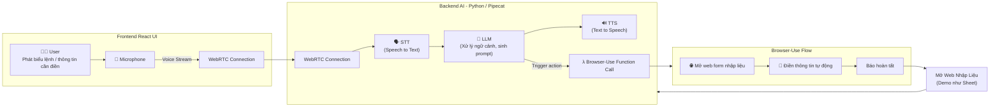
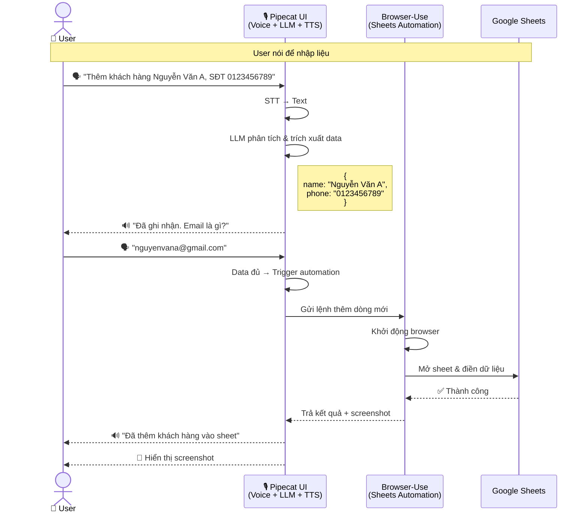
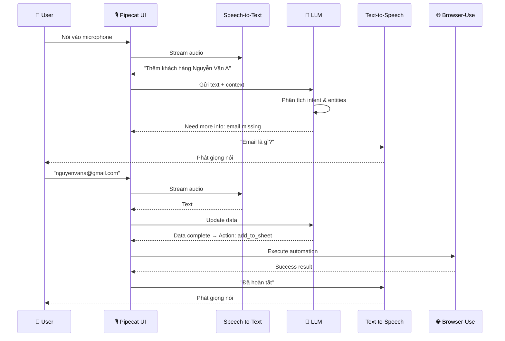
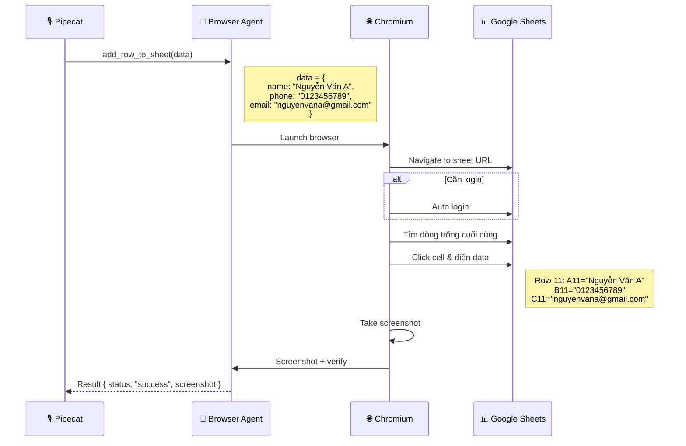
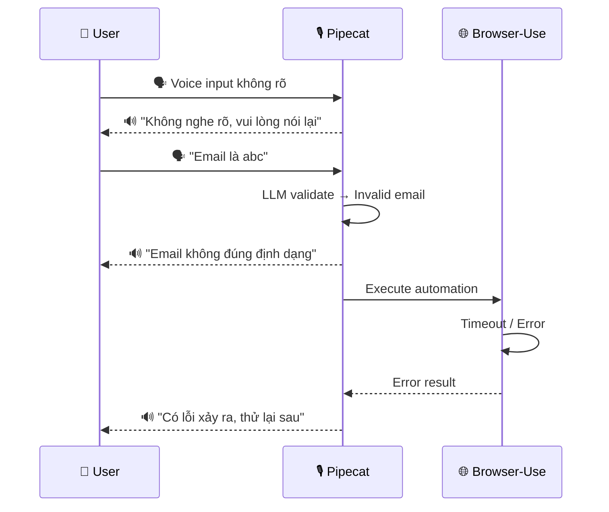

### 1. Kiến trúc tổng quan

**Giải thích:**
- **Frontend (React)**: User nói vào microphone → stream qua WebRTC
- **Backend (Pipecat)**: Nhận voice → STT chuyển thành text → LLM xử lý ngữ cảnh & quyết định → TTS trả lời
- **Browser-Use**: Nhận lệnh từ LLM → tự động mở browser → điền form/sheet → báo kết quả
- **Luồng**: User nói → Pipecat xử lý AI → gọi Browser-Use để automation → kết quả về User

---

### 2. Chi tiết Flow - Nhập liệu Google Sheet bằng giọng nói

#### 2.1. Flow tổng quan đơn giản

**Giải thích:**
- User nói thông tin khách hàng bằng tiếng nói
- Pipecat dùng LLM để hiểu ý định và trích xuất dữ liệu (tên, SĐT, email)
- Nếu thiếu thông tin, Pipecat hỏi lại bằng TTS
- Khi đủ dữ liệu → gọi Browser-Use để tự động điền vào Google Sheets
- Kết quả trả về với screenshot xác nhận

---

#### 2.2. Pipecat Flow - Xử lý voice & quyết định

* Tập trung vào: STT → LLM → TTS
* LLM thu thập đủ thông tin rồi mới trigger Browser-Use

**Giải thích:**
- **STT (Speech-to-Text)**: Chuyển giọng nói thành text
- **LLM**: Phân tích intent (ý định) & entities (tên, SĐT, email)
- LLM theo dõi context để biết còn thiếu thông tin gì
- **TTS (Text-to-Speech)**: Hỏi lại user để bổ sung thông tin
- Khi data đủ → trigger Browser-Use automation
- Conversational AI: hỏi đáp tự nhiên, không cần form cứng nhắc

---

#### 2.3. Browser-Use Flow - Automation Google Sheets

- nhận lệnh → launch browser → điền sheet → trả kết quả

**Giải thích:**
- Browser Agent nhận structured data từ Pipecat
- Launch Chromium browser (headless hoặc có UI)
- Navigate đến Google Sheets URL
- Tự động login nếu cần (dùng saved credentials)
- Tìm dòng trống cuối cùng trong sheet
- Click vào cells và điền data (giống người dùng thao tác)
- Chụp screenshot để verify
- Trả kết quả về Pipecat

---

#### 2.4. Error Handling - Xử lý lỗi đơn giản

- 3 case chính: voice unclear, validation, browser error

**Giải thích:**
- **Voice unclear**: STT không nghe rõ → yêu cầu nói lại
- **Validation**: LLM validate format (email, phone) → báo lỗi và hướng dẫn
- **Browser error**: Timeout, không truy cập được sheet, hoặc lỗi automation → thông báo lỗi
- Tất cả phản hồi đều qua TTS để user nghe, giữ trải nghiệm voice-first
- Có thể retry tự động hoặc yêu cầu user thử lại
