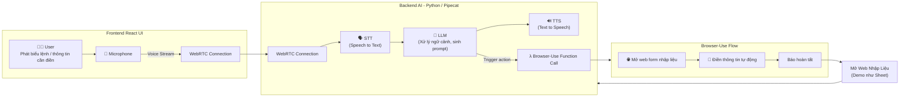
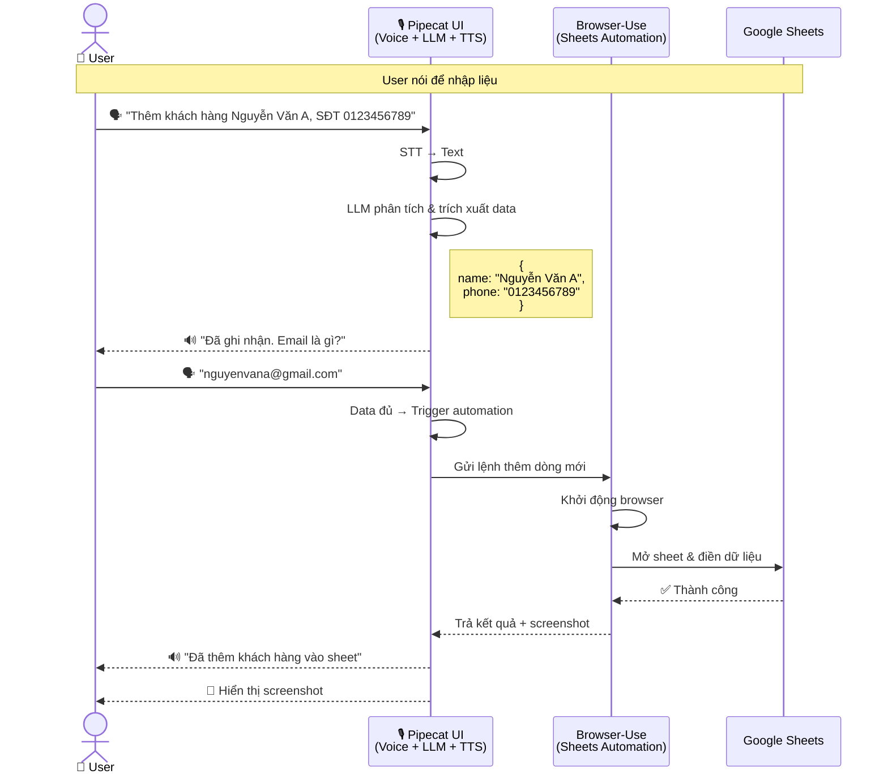
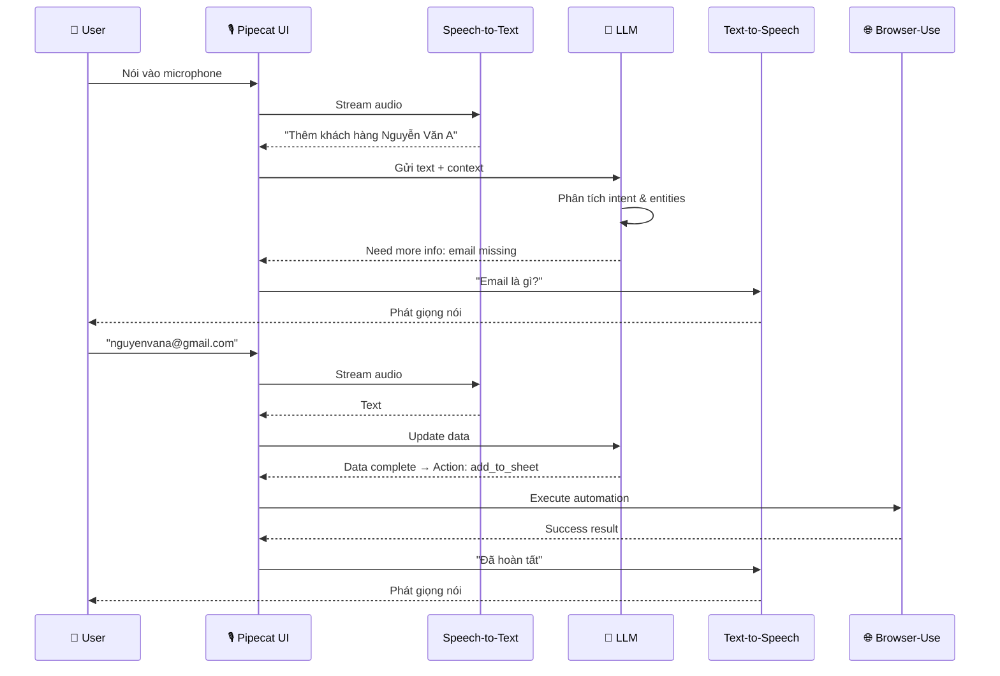
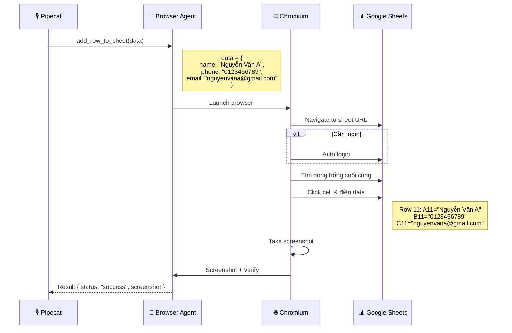
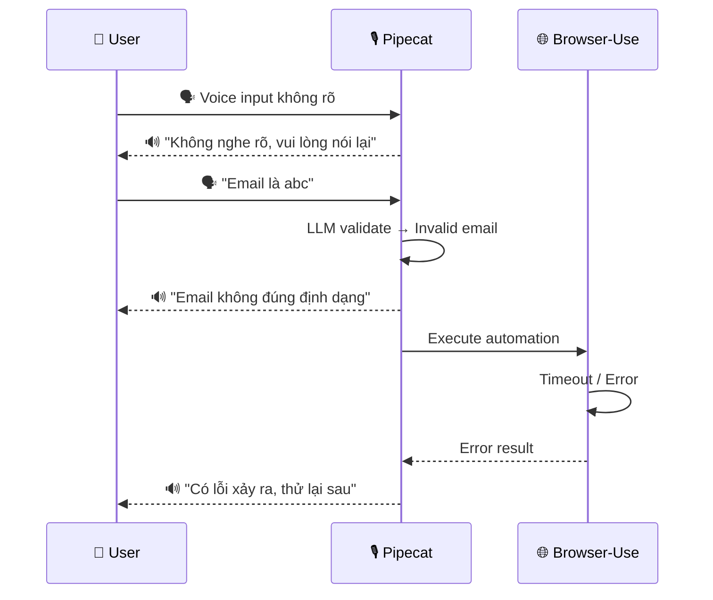

### 1. Kiến trúc tổng quan



**Giải thích:**
- **Frontend (React)**: User nói vào microphone → stream qua WebRTC
- **Backend (Pipecat)**: Nhận voice → STT chuyển thành text → LLM xử lý ngữ cảnh & quyết định → TTS trả lời
- **Browser-Use**: Nhận lệnh từ LLM → tự động mở browser → điền form/sheet → báo kết quả
- **Luồng**: User nói → Pipecat xử lý AI → gọi Browser-Use để automation → kết quả về User

---

### 2. Chi tiết Flow - Nhập liệu Google Sheet bằng giọng nói

#### 2.1. Flow tổng quan đơn giản



**Giải thích:**
- User nói thông tin khách hàng bằng tiếng nói
- Pipecat dùng LLM để hiểu ý định và trích xuất dữ liệu (tên, SĐT, email)
- Nếu thiếu thông tin, Pipecat hỏi lại bằng TTS
- Khi đủ dữ liệu → gọi Browser-Use để tự động điền vào Google Sheets
- Kết quả trả về với screenshot xác nhận

---

#### 2.2. Pipecat Flow - Xử lý voice & quyết định

* Tập trung vào: STT → LLM → TTS
* LLM thu thập đủ thông tin rồi mới trigger Browser-Use



**Giải thích:**
- **STT (Speech-to-Text)**: Chuyển giọng nói thành text
- **LLM**: Phân tích intent (ý định) & entities (tên, SĐT, email)
- LLM theo dõi context để biết còn thiếu thông tin gì
- **TTS (Text-to-Speech)**: Hỏi lại user để bổ sung thông tin
- Khi data đủ → trigger Browser-Use automation
- Conversational AI: hỏi đáp tự nhiên, không cần form cứng nhắc

---

#### 2.3. Browser-Use Flow - Automation Google Sheets

- nhận lệnh → launch browser → điền sheet → trả kết quả



**Giải thích:**
- Browser Agent nhận structured data từ Pipecat
- Launch Chromium browser (headless hoặc có UI)
- Navigate đến Google Sheets URL
- Tự động login nếu cần (dùng saved credentials)
- Tìm dòng trống cuối cùng trong sheet
- Click vào cells và điền data (giống người dùng thao tác)
- Chụp screenshot để verify
- Trả kết quả về Pipecat

---

#### 2.4. Error Handling - Xử lý lỗi đơn giản

- 3 case chính: voice unclear, validation, browser error



**Giải thích:**
- **Voice unclear**: STT không nghe rõ → yêu cầu nói lại
- **Validation**: LLM validate format (email, phone) → báo lỗi và hướng dẫn
- **Browser error**: Timeout, không truy cập được sheet, hoặc lỗi automation → thông báo lỗi
- Tất cả phản hồi đều qua TTS để user nghe, giữ trải nghiệm voice-first
- Có thể retry tự động hoặc yêu cầu user thử lại

---

## Hướng dẫn cài đặt và chạy dự án

### Yêu cầu hệ thống

- **Windows**: Phải sử dụng WSL2 (Windows Subsystem for Linux) cho backend
- **macOS/Linux**: Chạy trực tiếp
- **Python**: 3.10 trở lên
- **Node.js**: 18.x trở lên
- **Git**: Để clone repository

### 1. Cài đặt WSL2 (Chỉ dành cho Windows)

**Lý do**: Pipecat AI framework và các dependencies không hỗ trợ Windows native. Bắt buộc phải dùng WSL2.

#### Bước 1.1: Bật WSL2
```powershell
# Mở PowerShell với quyền Administrator và chạy:
wsl --install
```

#### Bước 1.2: Khởi động lại máy tính

#### Bước 1.3: Thiết lập Ubuntu
```bash
# WSL sẽ tự động cài Ubuntu. Sau khi khởi động lại, mở Ubuntu từ Start Menu
# Tạo username và password khi được yêu cầu
```

#### Bước 1.4: Cập nhật packages trong WSL
```bash
sudo apt update && sudo apt upgrade -y
```

#### Bước 1.5: Cài đặt Python 3.10+ trong WSL
```bash
# Kiểm tra version Python
python3 --version

# Nếu chưa có Python 3.10+, cài đặt:
sudo apt install python3.10 python3.10-venv python3-pip -y
```

#### Bước 1.6: Cài đặt Node.js trong WSL (cho frontend)
```bash
# Cài đặt nvm (Node Version Manager)
curl -o- https://raw.githubusercontent.com/nvm-sh/nvm/v0.39.0/install.sh | bash

# Restart terminal hoặc chạy:
source ~/.bashrc

# Cài đặt Node.js
nvm install 18
nvm use 18
node --version  # Kiểm tra version
```

### 2. Clone dự án

```bash
# Trong WSL (Windows) hoặc Terminal (macOS/Linux)
cd ~
git clone https://github.com/minhnghia2k3/Speak_To_Input.git
cd Speak_To_Input
```

### 3. Cấu hình Backend (Python)

#### Bước 3.1: Tạo virtual environment
```bash
python3 -m venv venv
source venv/bin/activate  # Kích hoạt virtual environment
```

#### Bước 3.2: Cài đặt dependencies
```bash
pip install --upgrade pip
pip install -r requirements.txt
```

#### Bước 3.3: Cài đặt Playwright browsers
```bash
# Cài đặt Chromium cho browser automation
playwright install chromium

# Nếu gặp lỗi thiếu dependencies (Linux/WSL), chạy thêm:
playwright install-deps chromium
```

#### Bước 3.4: Cấu hình biến môi trường
```bash
# Copy file .env.example thành .env
cp .env.example .env

# Mở file .env và điền các thông tin cần thiết:
nano .env  # hoặc dùng vi/vim/code
```

**Nội dung file .env cần điền:**
```bash
# AWS Credentials (cho STT và LLM)
AWS_ACCESS_KEY_ID=your_aws_access_key
AWS_SECRET_ACCESS_KEY=your_aws_secret_key
AWS_REGION=us-east-1

# AWS Bedrock Model
BEDROCK_MODEL_ID=us.anthropic.claude-sonnet-4-20250514-v1:0

# OpenAI API Key (cho TTS và Browser-Use Agent)
OPENAI_API_KEY=your_openai_api_key

# Google Sheets URL (thay YOUR_SHEET_ID bằng ID của sheet)
GOOGLE_SHEETS_URL=https://docs.google.com/spreadsheets/d/YOUR_SHEET_ID/edit
```

**Lưu ý:**
- AWS credentials cần có quyền truy cập AWS Transcribe và AWS Bedrock
- OPENAI_API_KEY dùng cho TTS (Text-to-Speech) và Browser-Use automation
- GOOGLE_SHEETS_URL phải là sheet public hoặc đã đăng nhập Google trong browser

### 4. Cấu hình Frontend (React)

#### Bước 4.1: Di chuyển vào thư mục frontend
```bash
cd frontend
```

#### Bước 4.2: Cài đặt dependencies
```bash
npm install
```

### 5. Chạy dự án

#### Cách 1: Chạy Backend và Frontend riêng biệt (Khuyên dùng cho development)

**Terminal 1 - Backend (trong WSL/Linux/macOS):**
```bash
# Từ thư mục gốc của project
cd ~/Speak_To_Input
source venv/bin/activate  # Kích hoạt virtual environment
python main.py
```

Backend sẽ chạy tại: http://localhost:7860

**Terminal 2 - Frontend:**
```bash
# Từ thư mục frontend
cd ~/Speak_To_Input/frontend
npm run dev
```

Frontend sẽ chạy tại: http://localhost:5173

#### Cách 2: Chạy cả hai với tmux/screen (Linux/macOS/WSL)

```bash
# Cài đặt tmux nếu chưa có
sudo apt install tmux -y  # Ubuntu/Debian/WSL

# Tạo session mới
tmux new-session -s vpbank

# Terminal 1: Chạy backend
cd ~/Speak_To_Input
source venv/bin/activate
python main.py

# Nhấn Ctrl+B rồi nhấn C để tạo window mới
# Terminal 2: Chạy frontend
cd ~/Speak_To_Input/frontend
npm run dev

# Để detach: Ctrl+B rồi D
# Để attach lại: tmux attach -t vpbank
```

### 6. Truy cập ứng dụng

1. Mở browser và truy cập: http://localhost:5173
2. Cho phép truy cập microphone khi được yêu cầu
3. Click nút "Connect" để bắt đầu
4. Nói tiếng Việt để điền form/Google Sheets

### 7. Kiểm tra logs

**Backend logs:**
```bash
# Logs sẽ hiển thị trực tiếp trên terminal chạy main.py
# Bao gồm:
# - WebRTC connection status
# - STT transcriptions
# - LLM responses
# - Browser automation actions
```

**Transcript files:**
```bash
# Lịch sử cuộc trò chuyện được lưu tại:
~/Speak_To_Input/transcripts/conversation_YYYYMMDD_HHMMSS.json
```

**Sheet data output:**
```bash
# Dữ liệu sheet được lưu tại:
~/Speak_To_Input/src/output/sheet_data_{session_id}.json
```

### 8. Troubleshooting (Xử lý lỗi thường gặp)

#### Lỗi 1: "Module not found" khi chạy backend
```bash
# Đảm bảo virtual environment đã được kích hoạt
source venv/bin/activate

# Cài lại dependencies
pip install -r requirements.txt
```

#### Lỗi 2: Playwright browser không tìm thấy
```bash
# Cài lại Chromium
playwright install chromium
playwright install-deps chromium  # Linux/WSL
```

#### Lỗi 3: Frontend không kết nối được backend
```bash
# Kiểm tra backend đang chạy tại port 7860
curl http://localhost:7860

# Kiểm tra CORS settings trong bot_form.py
# Đảm bảo Access-Control-Allow-Origin: '*'
```

#### Lỗi 4: Không nhận được audio trong Docker
```bash
# Đảm bảo đã cấu hình TURN server trong bot_form.py
# ice_servers phải có TURN server (đã được config sẵn)

# Container chỉ cần expose port 7860:
# docker run -p 7860:7860 ...
```

#### Lỗi 5: AWS credentials không hợp lệ
```bash
# Kiểm tra file .env
cat .env | grep AWS

# Test AWS credentials
aws sts get-caller-identity

# Đảm bảo có quyền truy cập Bedrock và Transcribe
```

#### Lỗi 6: Browser automation timeout
```bash
# Set headless=False để debug browser
# Trong src/browser_agent.py, sửa:
# headless=False

# Kiểm tra GOOGLE_SHEETS_URL có đúng không
# Đảm bảo sheet có quyền truy cập (public hoặc đã login)
```

### 9. Development Commands

```bash
# Backend - Chạy với debug logs
export PIPECAT_LOG_LEVEL=DEBUG
python main.py

# Frontend - Lint code
cd frontend
npm run lint

# Frontend - Build production
cd frontend
npm run build

# Frontend - Preview production build
cd frontend
npm run preview

# Backend - Chạy single test file
python test_stable_config.py
python test_google_sheets.py
```

### 10. Docker Deployment (Optional)

**Lưu ý**: Đã cấu hình TURN server để giải quyết vấn đề random UDP ports. Container chỉ cần expose port 7860.

```dockerfile
# Dockerfile (example)
FROM python:3.10-slim

# Install system dependencies
RUN apt-get update && apt-get install -y \
    git \
    && rm -rf /var/lib/apt/lists/*

WORKDIR /app

# Copy và install dependencies
COPY requirements.txt .
RUN pip install --no-cache-dir -r requirements.txt

# Install Playwright
RUN playwright install chromium
RUN playwright install-deps chromium

# Copy source code
COPY . .

# Expose port
EXPOSE 7860

# Run application
CMD ["python", "main.py"]
```

```bash
# Build và run Docker
docker build -t vpbank-voice-agent .
docker run -p 7860:7860 --env-file .env vpbank-voice-agent
```

### 11. Cấu trúc thư mục

```
VPBankHackathon/
├── src/                          # Backend source code
│   ├── bot_form.py              # WebRTC server & pipeline orchestrator
│   ├── flow_form.py             # Conversation flow logic
│   ├── prompt_form.py           # System prompts
│   ├── browser_agent.py         # Browser automation handler
│   └── utils/                   # Utility functions
├── frontend/                     # React frontend
│   ├── src/
│   │   └── App.tsx              # Main UI component
│   └── package.json
├── transcripts/                  # Conversation history (auto-generated)
├── venv/                         # Python virtual environment
├── main.py                       # Backend entry point
├── requirements.txt              # Python dependencies
├── .env                          # Environment variables (create from .env.example)
├── .env.example                  # Environment template
├── AGENTS.md                     # Guide for AI coding agents
├── CLAUDE.md                     # Detailed project documentation
└── README.md                     # This file
```

### 12. Tech Stack Summary

**Backend:**
- Python 3.10+
- Pipecat AI v0.0.78 (Voice AI framework)
- AWS Transcribe (STT - Vietnamese)
- AWS Bedrock Claude 3.5 Sonnet (LLM)
- OpenAI TTS (Text-to-Speech)
- browser-use + Playwright (Browser automation)
- aiohttp (WebRTC server)

**Frontend:**
- React 19.1 + TypeScript
- Vite (Build tool)
- Tailwind CSS
- Pipecat Voice UI Kit
- Small WebRTC (Real-time audio)

**Communication:**
- WebRTC for bidirectional audio streaming
- WebSocket for transcript streaming
- Free TURN server (openrelay.metered.ca) for Docker/NAT traversal

---